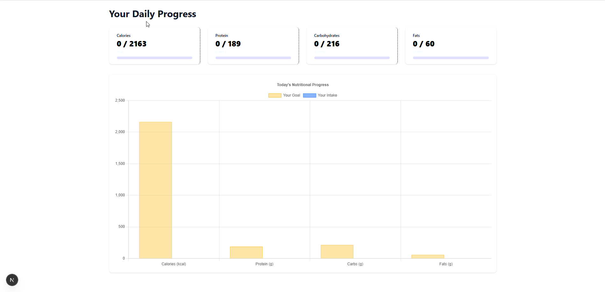
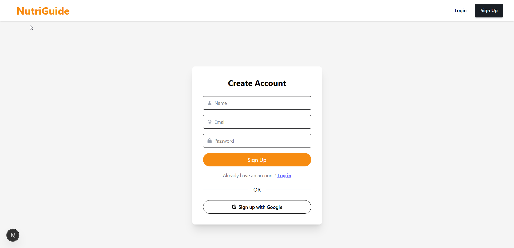
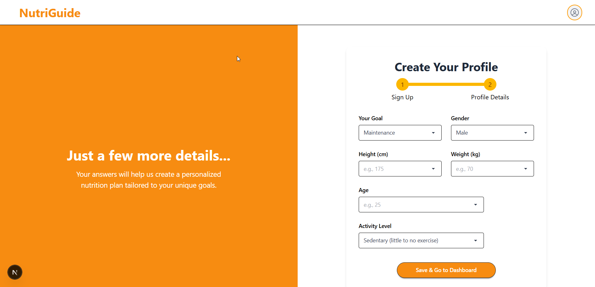
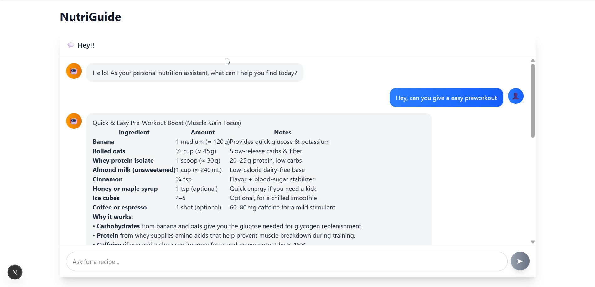
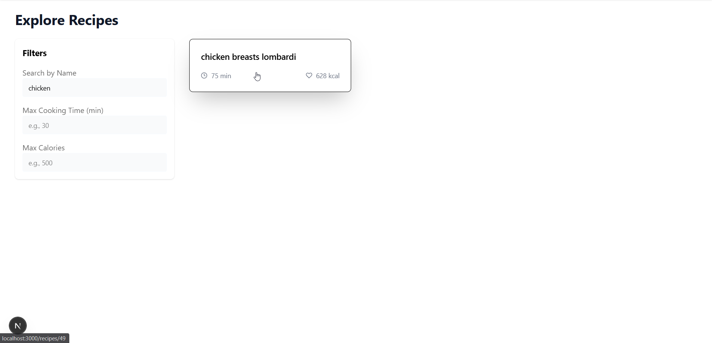
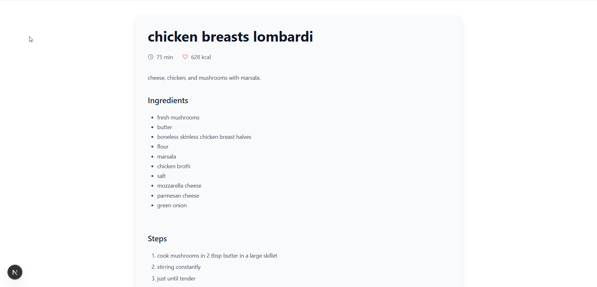

# NutriGuide - AI-Powered Personalized Nutrition & Recipe Assistant

A full-stack web application demonstrating advanced RAG (Retrieval-Augmented Generation) techniques, personalized user experiences, and modern web architecture.

[](https://drive.google.com/file/d/1Cob_HHlevTKpgNGs3F-8hw6CdpClRBuE/view?usp=sharing)

Watch the demo here!
---

## Overview

NutriGuide is more than just a recipe finder. It's an intelligent assistant designed to help users achieve their health goals (like weight loss or muscle gain) by providing personalized nutritional guidance and recipe suggestions through a conversational interface.

This project showcases the integration of:

- **Conversational AI:** Using Large Language Models (LLMs) and RAG for natural language understanding and recipe generation/modification.  
- **Personalization:** Calculating individual nutritional needs (BMR, TDEE, Macros) and tailoring suggestions accordingly.  
- **Full-Stack Development:** Utilizing a modern stack with a Next.js frontend and a FastAPI backend.  
- **Data Management:** Handling user data, recipe databases, and chat history.  

---

## Key Features

### 1.Secure User Authentication
Full signup/login system using NextAuth.js (Credentials & Google OAuth).

### 2.Personalized Onboarding
Collects user stats (height, weight, age, activity level) and health goals to calculate TDEE and Macro targets using the Nutrition Engine.

### 3.Conversational AI Assistant (RAG Powered)
- Users chat in natural language (e.g., "Find a low-carb vegetarian dinner under 500 calories").  
- **Retrieval:** Uses embedding models (via Hugging Face API) and a vector store (Pinecone concept, local ChromaDB for demo) to find relevant recipes.  
- **Augmentation:** Fetches full recipe details from the application database (PostgreSQL concept, SQLite for demo).  
- **Generation:** Uses a powerful LLM (via Groq - Llama 3) to generate personalized, conversational responses that mention the user's goal.  
- **Contextual Memory:** Remembers chat history to handle follow-up questions and modification requests (e.g., "Can you make that vegan?").  

### 4.Interactive Dashboard
- Visualizes daily nutritional intake (calories, protein, carbs, fats) against personalized goals using Chart.js.  
- Updates in real-time as users log meals.  

### 5.Recipe Exploration Page
- Visually browse recipes with filtering (search, max time, max calories) and pagination.  
- Links to detailed recipe view.  

### 6.Detailed Recipe View
Displays full ingredients and steps for a selected recipe.

### 7.One-Click Meal Logging
Users can log meals directly from the recipe page, automatically updating their dashboard.

---

## Screenshots / GIF Demo

Include high-quality screenshots or short GIFs showcasing the main UI components here. Suggested views:

###  Login / Signup


###  Onboarding Form


###  Dashboard


###  Chat Interface


###  Recipe Exploration


###  Detailed Recipe View


---

## Tech Stack

1.**Frontend:** Next.js (App Router), React, Tailwind CSS, daisyUI, Chart.js, Framer Motion, react-markdown  

2.**Backend:** FastAPI, Python, SQLAlchemy  

3.**AI / RAG:**  
- LLM: Llama 3 (via Groq API)  
- Embeddings: all-MiniLM-L6-v2 (via Hugging Face Inference API)  
- Vector Store Concept: Pinecone / Weaviate (ChromaDB used locally for demo)  
- Orchestration: LangChain  
- Authentication: NextAuth.js (Credentials & Google OAuth)  

4.**Databases:**  
- Application Data: PostgreSQL Concept (Neon/Supabase) - SQLite used for local demo  
- Authentication Data: MongoDB (via NextAuth adapter)  

5.**Deployment Concept:** Vercel (Frontend), Render/Koyeb/Fly.io (Backend) - Currently configured for local demo.

---

## 🐳 Running with Docker (Recommended)

The entire stack (PostgreSQL, MongoDB, FastAPI backend, Next.js frontend) runs with a single command.

### Prerequisites
- [Docker Desktop](https://www.docker.com/products/docker-desktop/) installed and running

### 1. Set up secrets

```bash
# Root .env (for docker-compose frontend secrets)
cp .env.example .env

# Backend secrets (API keys)
cp backend/.env.example backend/.env
```

Edit `.env` and `backend/.env` with your actual API keys:
- `backend/.env`: Add `GROQ_API_KEY`, `PINECONE_API_KEY`, `HF_TOKEN`
- `.env`: Add `NEXTAUTH_SECRET`, `GOOGLE_CLIENT_ID`, `GOOGLE_CLIENT_SECRET`

### 2. Start everything

```bash
docker compose up --build
```

On the **first run**, the backend will be built with the ML model pre-cached (~5–10 min depending on your machine). Subsequent starts are instant.

### 3. Initialize the database (first run only)

After containers are running, create the PostgreSQL tables and load the recipe dataset:

```bash
# Create tables
docker compose exec backend python create_db.py

# Load recipe data (requires recipes.csv in backend/)
docker compose exec backend python load_data.py
```

### 4. Access the app

| Service | URL |
|---|---|
| 🌐 Frontend | http://localhost:3000 |
| ⚡ Backend API | http://localhost:8000 |
| 📚 API Docs (Swagger) | http://localhost:8000/docs |

### 5. Stop & data management

```bash
docker compose down          # Stop containers (data persists in volumes)
docker compose down -v       # Stop + delete all data volumes (clean slate)
```

---


This project utilizes a decoupled, microservices-style architecture:

- **Next.js Frontend (Vercel Concept):** Handles all user interface rendering and manages authentication state via NextAuth.js.  
- **FastAPI Backend (Render/Koyeb Concept):** A dedicated, lightweight service responsible for:  
  - User profile management (goals, stats)  
  - Nutritional calculations  
  - Orchestrating the RAG pipeline (calling embedding API, vector store, fetching data, prompting LLM)  
  - Managing meal logs and chat history  

**External Databases (Cloud Concept):**  
- PostgreSQL (Neon/Supabase): Stores structured application data (users, recipes, logs). SQLite is used in this demo configuration.  
- Vector DB (Pinecone): Stores recipe embeddings for fast semantic search. A local vector store is used in this demo configuration.  
- MongoDB: Stores authentication credentials securely via NextAuth.js.  

This separation ensures scalability, maintainability, and allows for using specialized services for each task.

---

## Running Locally (Demo Setup)

### Clone Repositories
Clone both the frontend and backend repositories.

### Download Dataset
Download the ["Food.com Recipes and Interactions"](https://www.kaggle.com/datasets/shuyangli94/food-com-recipes-and-user-interactions) dataset from Kaggle.  
Unzip the file and place the `recipes.csv` file inside the backend directory.

### Backend Setup
1. Navigate to the backend directory.  
2. Create and activate a Python virtual environment:  
````bash
   conda create -n nutriguide python=3.11
   conda activate nutriguide
   ````
3. Install dependencies:
````bash
   pip install -r requirements.txt
   ````

4. Create a .env file based on .env.example (if provided) and add your API keys (Groq, Hugging Face). Ensure DATABASE_URL is set for SQLite (e.g., sqlite:///nutriguide.db).

5. Run the backend server:
````bash
python create_db.py
python load_data.py
uvicorn app.main:app --reload
````
(This creates/populates the SQLite DB on startup.)

### Frontend Setup
1. Navigate to the frontend directory.

2. Install dependencies:
````
npm install
````

3. Create a .env.local file based on .env.local.example (if provided). Add your NEXTAUTH_SECRET, Google OAuth credentials, and set NEXT_PUBLIC_API_URL=http://127.0.0.1:8000.

4. Run the frontend server:
````
npm run dev
````

5. Access: Open [http://localhost:3000](http://localhost:3000/) in your browser.

---

### Future Improvements

-Implement full cloud deployment using Neon/Supabase, Pinecone, Render, and Vercel.

-Add Pantry Scanner feature using computer vision.

-Implement Smart Shopping List generation.

-Enhance filtering options on the Recipes page (e.g., by tags, cuisine).
